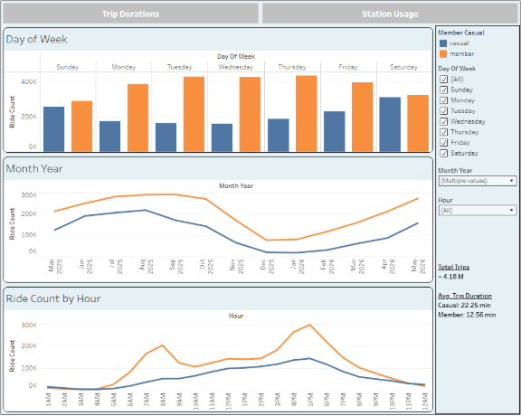
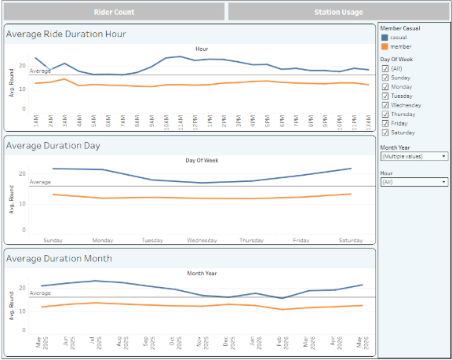
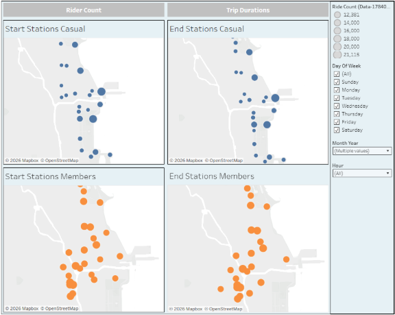

# **Cyclistic Bike-Share Case Study**
## **Project Overview**
This project was completed as part of the Google Data Analytics Professional Certificate. Acting as a Data Analyst for Cyclistic, a fictional bike-share company based in Chicago, I analyzed one year of ride data to better understand the behavioral differences between annual members and casual riders.\
\
The marketing team believes that converting casual riders into annual members will increase long-term profitability. This analysis focuses on identifying usage patterns that can help guide future marketing strategies.
## **Business Task**
Questions addressed:\
• How do annual member and casual riders use Cyclistic bikes differently?\
• Why would casual riders buy Cyclistic annual memberships?\
• How can Cyclistic use digital media to influence casual riders to become members?\
\
The primary objective of this project is answering the first question while providing recommendations that support the remaining business objectives.
## **Data Source**
Source: https://divvy-tripdata.s3.amazonaws.com/index.html\
\
Time Period: May 2025 through April 2026 (12 months of ride data).
## **Tools Used**
• SQL\
• Tableau Public\
• GitHub
## **Data Preparation**
The monthly datasets were combined into a single PostgreSQL database. Cleaning steps included:\
• Combining 12 monthly datasets\
• Removing duplicate records\
• Removing rides shorter than one minute\
• Removing rides longer than 24 hours\
• Removing records with missing station coordinates\
• Standardizing station names\
• Creating calculated date and time fields\
• Preparing aggregated tables for Tableau visualizations\
\
The cleaned dataset contained over 4 million valid trips.
## **SQL Analysis**
SQL was used to aggregate ride counts, calculate average ride durations, compare rider types, analyze trends by month, weekday, and hour, and prepare station-level data for Tableau maps.
## **Tableau Dashboard**
The cleaned data was imported into Tableau to create an interactive dashboard featuring Ride Count Analysis, Weekend Ride Analysis, Ride Duration Analysis, and Start/End Station Maps. Dashboard filters allow users to explore results by rider type, month, weekday, and hour.
## **Key Findings**
• Members primarily use Cyclistic bikes for weekday commuting, with peaks around 8 AM and 5 PM.\
• Casual riders are more recreational, showing stronger weekend and summer activity.\
• Casual riders take longer trips on average.\
• Casual riders are concentrated along Chicago's lakefront while members are more evenly distributed inland.\
• Casual ridership increases significantly from late spring through summer.
## **Recommendations**
• Launch seasonal membership campaigns beginning in early spring.\
• Focus advertisements around Chicago's lakefront stations.\
• Promote the cost savings of annual memberships for riders taking longer recreational trips.\
• Evaluate a seasonal membership option targeted toward summer riders.
## **Skills Demonstrated**
• SQL Data Cleaning\
• Data Transformation\
• Exploratory Data Analysis\
• Geographic Analysis\
• Dashboard Design\
• Data Visualization\
• Business Analysis\
• Business Recommendations
## **Future Improvements**
Potential future enhancements include weather integration, event-based ridership analysis, predictive modeling, membership conversion forecasting, and demographic analysis if additional data becomes available.
## **Dashboard Preview**

